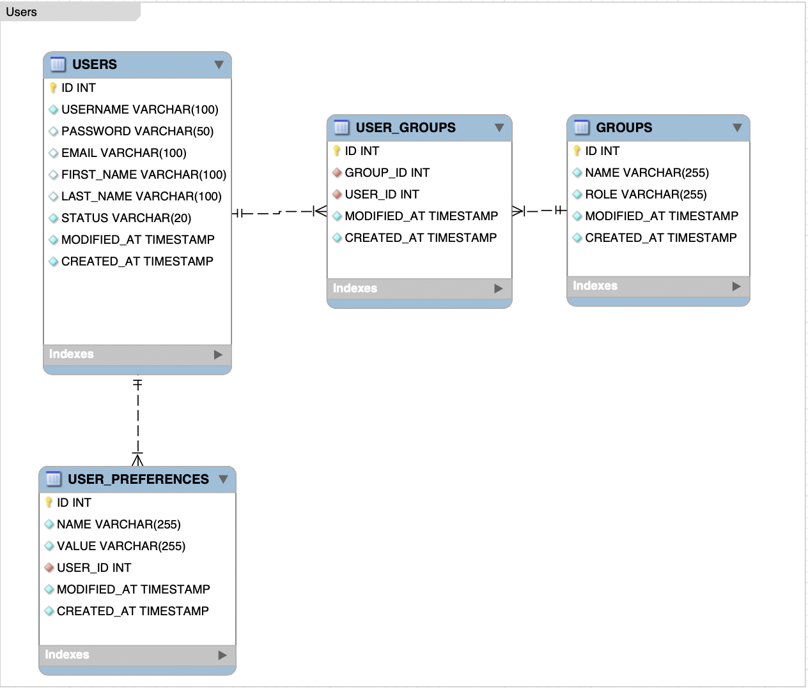

# Database usage

Here is a simple DB schema that will be used for this sample:

We will implement mapping for Users and UserPreferences tables.

## Dependencies
For integration with DB, we recommend to use [MyBatis](http://www.mybatis.org/mybatis-3) ORM framework. MyBatis is a first class persistence framework with support for custom SQL, stored procedures and advanced mappings. To start with, let's add the required dependencies into Maven pom.xml:
```xml
<dependency>
   <groupId>org.mybatis</groupId>
   <artifactId>mybatis</artifactId>
   <version>3.5.2</version>
</dependency>
<!-- Postgres driver -->
<dependency> 
   <groupId>org.postgresql</groupId>
   <artifactId>postgresql</artifactId>
   <version>42.2.6</version>
</dependency>
<!-- MySQL driver -->
<dependency>
   <groupId>mysql</groupId>
   <artifactId>mysql-connector-java</artifactId>
   <version>8.0.17</version>
</dependency>
```

## Mappers
The next step is MyBatis mappers implementation, read [the official documentation](http://www.mybatis.org/mybatis-3/sqlmap-xml.html) to understand all the details. Let's place all the mappers into **src/main/resources/mappers**. Here is a [UserMapper.xml](https://github.com/qaprosoft/carina-demo/blob/master/src/main/resources/mappers/UserMapper.xml) sample:
```xml
<?xml version="1.0" encoding="UTF-8"?>
<!DOCTYPE mapper PUBLIC "-//mybatis.org//DTD Mapper 3.0//EN" "http://mybatis.org/dtd/mybatis-3-mapper.dtd">

<mapper namespace="com.qaprosoft.carina.demo.db.mappers.UserMapper">

	<insert id="create" useGeneratedKeys="true" keyProperty="id">
		<![CDATA[
			INSERT INTO carina.USERS (USERNAME, PASSWORD, FIRST_NAME, LAST_NAME, EMAIL, STATUS)
			VALUES (
				#{username},
				#{password},
			    #{firstName},
				#{lastName},
				#{email},
				#{status}
			)
		]]>
	</insert>

	<sql id="getUser">
		<![CDATA[
			SELECT
				U.ID AS USER_ID,
				U.USERNAME AS USER_USERNAME,
				U.PASSWORD AS USER_PASSWORD,
				U.FIRST_NAME AS USER_FIRST_NAME,
				U.LAST_NAME AS USER_LAST_NAME,
				U.EMAIL AS USER_EMAIL,
				U.STATUS AS USER_STATUS,
				UP.ID AS USER_PREFERENCE_ID,
				UP.NAME AS USER_PREFERENCE_NAME,
				UP.VALUE AS USER_PREFERENCE_VALUE,
				UP.USER_ID AS USER_PREFERENCE_USER_ID
			FROM
				carina.USERS U
			LEFT JOIN
				carina.USER_PREFERENCES UP
			ON
				UP.USER_ID = U.ID
		]]>
	</sql>

	<select id="findById" resultMap="UserResultMap">
		<include refid="getUser" />
		<![CDATA[
			WHERE U.ID = #{id};
		]]>
	</select>

	<select id="findByUserName" resultMap="UserResultMap">
		<include refid="getUser" />
		<![CDATA[
			WHERE U.USERNAME = #{username};
		]]>
	</select>

	<update id="update">
		<![CDATA[
			UPDATE
			    carina.USERS
		]]>
		<set>
			<if test="null != firstName">
		            <![CDATA[
		               FIRST_NAME = #{firstName},
		            ]]>
			</if>
			<if test="null != lastName">
		            <![CDATA[
		               LAST_NAME = #{lastName},
		            ]]>
			</if>
			<if test="null != email">
		            <![CDATA[
		               EMAIL = #{email},
		            ]]>
			</if>
			<if test="null != username">
		            <![CDATA[
		               USERNAME = #{username},	
		            ]]>
			</if>
			<if test="null != password">
		            <![CDATA[
		               PASSWORD = #{password},	
		            ]]>
			</if>
		</set>
		<![CDATA[
			WHERE
			    ID = #{id}
		]]>
	</update>

	<delete id="delete">
		<![CDATA[
			DELETE FROM carina.USERS
			WHERE ID = #{id}
		]]>
	</delete>

	<resultMap type="com.qaprosoft.carina.demo.db.models.User"
		id="UserResultMap" autoMapping="false">
		<id column="USER_ID" property="id" />
		<result column="USER_USERNAME" property="username" />
		<result column="USER_PASSWORD" property="password" />
		<result column="USER_FIRST_NAME" property="firstName" />
		<result column="USER_LAST_NAME" property="lastName" />
		<result column="USER_EMAIL" property="email" />
		<result column="USER_STATUS" property="status" />
		<collection property="preferences"
			ofType="com.qaprosoft.carina.demo.db.models.UserPreference"
			resultMap="com.qaprosoft.carina.demo.db.mappers.UserPreferenceMapper.UserPreferenceResultMap" />
	</resultMap>

</mapper>
```

Now we have to implement a DB domain object [User class](https://github.com/qaprosoft/carina-demo/blob/master/src/main/java/com/qaprosoft/carina/demo/db/models/User.java) which reflects the DB table structure:
```java
package com.qaprosoft.carina.demo.db.models;

import java.util.ArrayList;
import java.util.List;

public class User {

	private Long id;
	private String username;
	private String password;
	private String email;
	private String firstName;
	private String lastName;
	private Status status;
	private List<UserPreference> preferences = new ArrayList<>();

	public User() {
	}

	public enum Status {
		ACTIVE, INACTIVE
	}

	public Long getId() {
		return id;
	}

	public void setId(Long id) {
		this.id = id;
	}

	public String getUsername() {
		return username;
	}

	public void setUsername(String username) {
		this.username = username;
	}

	public String getPassword() {
		return password;
	}

	public void setPassword(String password) {
		this.password = password;
	}

	public String getEmail() {
		return email;
	}

	public void setEmail(String email) {
		this.email = email;
	}

	public String getFirstName() {
		return firstName;
	}

	public void setFirstName(String firstName) {
		this.firstName = firstName;
	}

	public String getLastName() {
		return lastName;
	}

	public void setLastName(String lastName) {
		this.lastName = lastName;
	}

	public List<UserPreference> getPreferences() {
		return preferences;
	}

	public void setPreferences(List<UserPreference> preferences) {
		this.preferences = preferences;
	}

	public Status getStatus() {
		return status;
	}

	public void setStatus(Status status) {
		this.status = status;
	}
}
```

Also, we have to describe the mapper interface, [UserMapper interface](https://github.com/qaprosoft/carina-demo/blob/master/src/main/java/com/qaprosoft/carina/demo/db/mappers/UserMapper.java):

```java
package com.qaprosoft.carina.demo.db.mappers;

import com.qaprosoft.carina.demo.db.models.User;

public interface UserMapper {

	void create(User user);

	User findById(long id);

	User findByUserName(String username);

	void update(User user);

	void delete(User user);

}

```

## Configuration
First of all, we need to place DB credentials into **src/main/resources/_database.properties**:
```
#===============================================================#
#================== Database configuration ====================#
#===============================================================#
db.url=jdbc:postgresql://localhost:5432/postgres
db.driver=org.postgresql.Driver
db.user=postgres
db.pass=postgres

#db.url=jdbc:mysql://localhost:3306/mysql
#db.driver=com.mysql.jdbc.Driver
#db.user=mysql
#db.pass=mysql
```

All the mappers and reference to _database.properties should be specified in **src/main/resources/mybatis-config.xml**:
```xml
<?xml version="1.0" encoding="UTF-8" ?>
<!DOCTYPE configuration
  PUBLIC "-//mybatis.org//DTD Config 3.0//EN"
  "http://mybatis.org/dtd/mybatis-3-config.dtd">
<configuration>
	<properties resource="_database.properties" />

	<environments default="development">
		<environment id="development">
			<transactionManager type="JDBC" />
			<dataSource type="POOLED">
				<property name="driver" value="${db.driver}" />
				<property name="url" value="${db.url}" />
				<property name="username" value="${db.user}" />
				<property name="password" value="${db.pass}" />
			</dataSource>
		</environment>
	</environments>
	
	<mappers>
		<mapper resource="mappers/UserMapper.xml" />
		<mapper resource="mappers/UserPreferenceMapper.xml" />
	</mappers>
</configuration>
```

## Connection factory
Connection factory is responsible for MyBatis context initialization and creation of mapper instances, take a look at the sample implementation of [ConnectionFactory](https://github.com/qaprosoft/carina-demo/blob/master/src/main/java/com/qaprosoft/carina/demo/utils/ConnectionFactory.java):
```java
package com.qaprosoft.carina.demo.utils;

import java.io.IOException;
import java.io.Reader;

import org.apache.ibatis.io.Resources;
import org.apache.ibatis.session.SqlSessionFactory;
import org.apache.ibatis.session.SqlSessionFactoryBuilder;

import com.qaprosoft.carina.demo.db.mappers.UserMapper;
import com.qaprosoft.carina.demo.db.mappers.UserPreferenceMapper;

public class ConnectionFactory {
	private static SqlSessionFactory factory;

	static {
		Reader reader = null;
		try {
			reader = Resources.getResourceAsReader("mybatis-config.xml");
		} catch (IOException e) {
			throw new RuntimeException(e.getMessage());
		}
		factory = new SqlSessionFactoryBuilder().build(reader);
	}

	public static SqlSessionFactory getSqlSessionFactory() {
		return factory;
	}

	public static UserMapper getUserMapper() {
		return ConnectionFactory.getSqlSessionFactory().openSession(true).getMapper(UserMapper.class);
	}

	public static UserPreferenceMapper getUserPreferenceMapperMapper() {
		return ConnectionFactory.getSqlSessionFactory().openSession(true).getMapper(UserPreferenceMapper.class);
	}
}
```

## Usage sample
Finally, [DBSampleTest](https://github.com/qaprosoft/carina-demo/blob/master/src/test/java/com/qaprosoft/carina/demo/DBSampleTest.java) illustrates the usage of MyBatis in tests:
```java
package com.qaprosoft.carina.demo;

import static org.testng.Assert.assertEquals;
import static org.testng.Assert.assertNull;

import org.apache.ibatis.session.SqlSession;
import org.testng.annotations.Test;
import com.qaprosoft.carina.core.foundation.AbstractTest;
import com.qaprosoft.carina.demo.db.mappers.UserMapper;
import com.qaprosoft.carina.demo.db.mappers.UserPreferenceMapper;
import com.qaprosoft.carina.demo.db.models.User;
import com.qaprosoft.carina.demo.db.models.User.Status;
import com.qaprosoft.carina.demo.utils.ConnectionFactory;
import com.qaprosoft.carina.demo.db.models.UserPreference;

/**
 * This sample shows how create DB test.
 * 
 * @author qpsdemo
 */
public class DBSampleTest extends AbstractTest {

	...

	@Test
	public void createUser() {
		try (SqlSession session = ConnectionFactory.getSqlSessionFactory().openSession(true)) {
			UserMapper userMapper = session.getMapper(UserMapper.class);
			userMapper.create(USER);
			checkUser(userMapper.findById(USER.getId()));
		}
	}

	@Test(dependsOnMethods = "createUser")
	public void createUserPreference() {
		try (SqlSession session = ConnectionFactory.getSqlSessionFactory().openSession(true)) {
			UserMapper userMapper = session.getMapper(UserMapper.class);
			UserPreferenceMapper userPreferenceMapper = session.getMapper(UserPreferenceMapper.class);
			USER_PREFERENCE.setUserId(USER.getId());
			userPreferenceMapper.create(USER_PREFERENCE);
			checkUserPreference(userMapper.findById(USER.getId()).getPreferences().get(0));
		}
	}

	...
}
```
