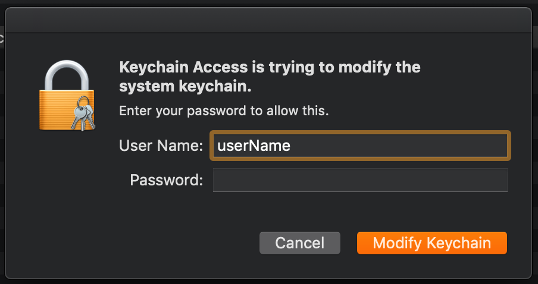
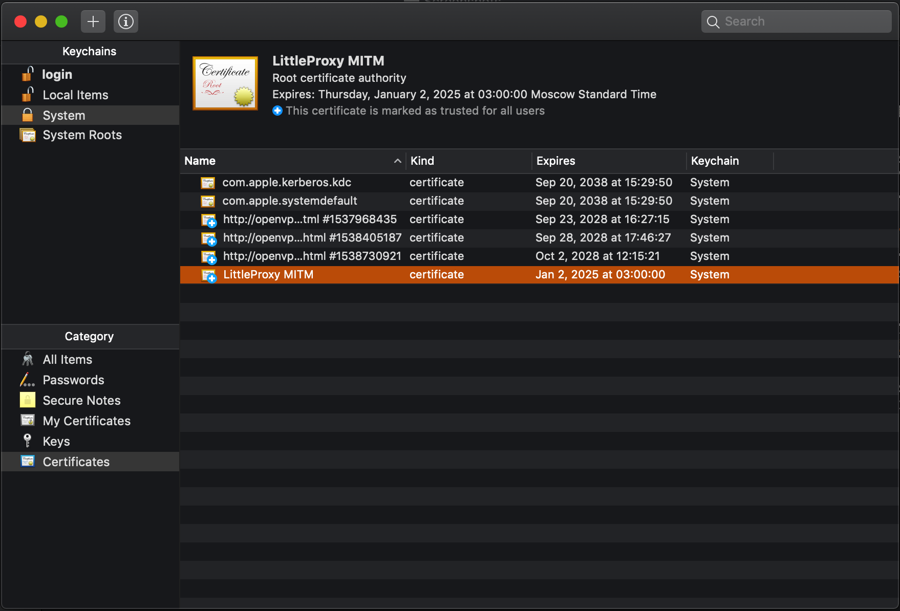

### Operating with Proxies
There is a possibility to send all test traffic via proxy including the embedded light-weight BrowserMob proxy server.
There are several properties available to manage all kinds of proxy usage:
```
proxy_host=NULL
proxy_port=NULL
proxy_protocols=http,https,ftp
proxy_set_to_system=true
browsermob_proxy=false
browsermob_host=NULL
browsermob_disabled_mitm=false
browsermob_port=0
```
Declare proxy_host, proxy_port and proxy_protocols to send all Web and API test traffic via your static network proxy.
Also, to enable proxy for TestNG Java process, **proxy_set_to_system** must be specifed to **true**, otherwise only WebDrivers and API clients will be proxied.

Note: The above settings are mostly required to get public internet access through corporate proxies.

### Raising inbuilt proxy-server (BrowserMob)
Also, Carina can start an embedded proxy to proxy/view/filter requests/responses. There is an inbuilt library BrowserMobProxy in Carina-proxy module. Below you can find BrowserMob proxy related parameters in your **config.properties** file:
```
browsermob_proxy=true
browsermob_host=NULL
browsermob_disabled_mitm=false
browsermob_port=0
```
With the enabled **browsermob_proxy**, Carina will start the dedicated proxy instance on every test method. 

**browsermob_host=NULL** means that Carina automatically detects an IP address and puts it into the capabilities, etc.

**browsermob_host=myhostname** is useful in case of running maven process inside a docker container. Override the hostname, and it will be available from Selenium instance.

**browsermob_port=0** means that Carina dynamically identifies a free port for a proxy session.

**browsermob_disabled_mitm** is disabled by default. 

**Important!** If you have troubles with  SSL traffic sniffing, the first thing you should do is to change **browsermob_disabled_mitm** property value!

#### Using proxy-server in Java code:

1. Make sure the driver instance is already started:
```
getDriver();
```
Note: During the driver startup, Carina automatically starts proxy and adjusts browser capabilities to track the desired protocols. To get proxy instance for the current test/thread, you can call:
```
BrowserMobProxy proxy = ProxyPool.getProxy();
```
2. Enable the required Har capture type using:
```
proxy.enableHarCaptureTypes(CaptureType.REQUEST_CONTENT, CaptureType.RESPONSE_CONTENT);
```
There are a lot of possible content types:
```
CaptureType.RESPONSE_COOKIES
CaptureType.RESPONSE_HEADERS
CaptureType.REQUEST_HEADERS
CaptureType.RESPONSE_CONTENT
CaptureType.REQUEST_CONTENT
...
```
They all can be set as comma-separated parameters.

4. You may want to save the captured content into a .har file:
```
proxy.newHar(HAR_NAME);

//Some testing activity...

//Saving har to a file...
File file = new File(HAR_NAME + ".har");
Assert.assertNotNull(proxy.getHar(), "Har is NULL!");

try {
    proxy.getHar().writeTo(file);
} catch (IOException e) {
    e.printStackTrace();
}
```
Your .har file will be created in the project root folder

5. There are four methods to support request and response interception:

* addRequestFilter
* addResponseFilter
* addFirstHttpFilterFactory
* addLastHttpFilterFactory

To add and configure content filters, look [here](https://github.com/lightbody/browsermob-proxy#http-request-manipulation).

#### Dealing with MITM and installing SSL certificate into your system:

##### For Mac users:

1. Go [here](https://github.com/lightbody/browsermob-proxy/blob/master/browsermob-core/src/main/resources/sslSupport/ca-certificate-rsa.cer) and save it as **ca-certificate-rsa.cer**.
2. A double click creates a file. The next window should appear:



3. After authorization, the certificate will be added into your system certificates,  but it's still untrusted:


4. To make it trusted, double click on it. The following window should appear:


5. First, click the drop-down menu and select **Always Trust** option. Then close the window (a second authorization will be required):


6. Make sure the red cross on your certificate turned into a blue one:



#### Adding SSL certificate into Java keystore:

If you are still receiving the following exception:
```
javax.net.ssl.SSLHandshakeException: sun.security.validator.ValidatorException: PKIX path building failed: sun.security.provider.certpath.SunCertPathBuilderException: unable to find valid certification path to requested target
```
you may need to set up **ca-certificate-rsa.cer** into your Java keystore.

##### For Mac and Linux users:

```
sudo keytool -importcert -alias browsermob -file pathToYourCertificateLocation/BrowserMobCertificate.crt -keystore /Library/Java/JavaVirtualMachines/jdk1.8.0_181.jdk/Contents/Home/jre/lib/security/cacerts
```
You will be asked to enter your Mac profile password and a Java keystore password (by default: changeit).
