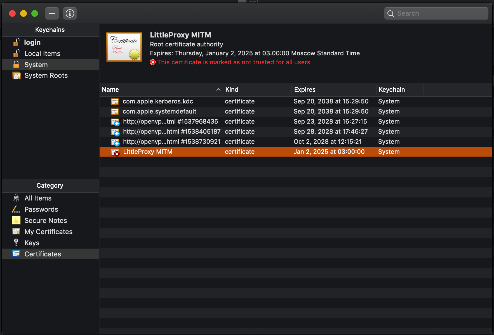
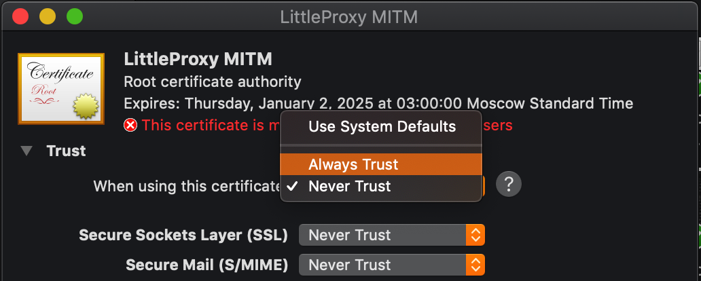

### Operating with Proxies
There is possibility to send all test traffic via the proxy included embelled light-weight BrowserMob proxy server.
Ther are several properties available to manage all kind of proxies usage:
```
proxy_host=NULL
proxy_port=NULL
proxy_protocols=http,https,ftp
proxy_set_to_system=true
browsermob_proxy=false
browsermob_disabled_mitm=false
browsermob_port=0
```
Declare proxy_host, proxy_port and proxy_protocols to send all Web and API test traffic via your static network proxy.
Also to enable proxy for TestNG Java process **proxy_set_to_system** must be specifed to **true** otherwise only WebDrivers and API clients will be proxied

Note: Above settings mostly required to get public internet access through corporate proxies.

### Raising inbuilt proxy-server (BrowserMob)
Also Carina can start embedded proxy to proxy/view/filter requests/responses. There is inbuilt library BrowserMobProxy in carina-proxy module. Below you can find BrowserMob proxy related parameters in your **config.properties** file:
```
browsermob_proxy=true
browsermob_disabled_mitm=false
browsermob_port=0
```
With enabled **browsermob_proxy** Carina will start dedicated proxy instance on every test method. 

**browsermob_port=0** means that Carina dynamically identify free port for proxy session.

**browsermob_disabled_mitm** is disabled by default. 

**Important!** If you have troubles with  SSL traffic sniffering first thing you should do - change **browsermob_disabled_mitm** property value!

#### Using proxy-server in java code:

1. Make sure driver instance is already started:
```
getDriver();
```
Note: During driver startup Carina automatically start proxy and adjust browser capabilities to track desired protocols. To get proxy instance for the current test/thread you can call:
```
BrowserMobProxy proxy = ProxyPool.getProxy();
```
2. Enable required Har capture type using::
```
proxy.enableHarCaptureTypes(CaptureType.REQUEST_CONTENT, CaptureType.RESPONSE_CONTENT);
```
There are a lot of possible content types:
```
CaptureType.RESPONSE_COOKIES
CaptureType.RESPONSE_HEADERS
CaptureType.REQUEST_HEADERS
CaptureType.RESPONSE_CONTENT
CaptureType.REQUEST_CONTENT
...
```
They all can be set as comma separated parameters.

4. You may want to save captured content into a .har file:
```
proxy.newHar(HAR_NAME);

//Some testing activity...

//Saving har to a file...
File file = new File(HAR_NAME + ".har");
Assert.assertNotNull(proxy.getHar(), "Har is NULL!");

try {
    proxy.getHar().writeTo(file);
} catch (IOException e) {
    e.printStackTrace();
}
```
Your .har file will be created in project root folder

5. There are four methods to support request and response interception:

* addRequestFilter
* addResponseFilter
* addFirstHttpFilterFactory
* addLastHttpFilterFactory

To add and configure content filters look [here](https://github.com/lightbody/browsermob-proxy#http-request-manipulation).

#### Dealing with MITM and installing SSL sertificate into your system:

##### For Mac users:

1. Go [here](https://github.com/lightbody/browsermob-proxy/blob/master/browsermob-core/src/main/resources/sslSupport/ca-certificate-rsa.cer) and save it as **ca-certificate-rsa.cer**.
2. Double click created file. Next window should be shown:


3. After authorization the certificate will be added into your system certificates,  but it's still untrusted:



4. To make it trusted double click on it. Following window should be shown:


5. Click first drop-down menu and select **Always Trust** option. Then close the window (second authorization will be required):



6. Make sure red cross on your certificate turned into a blue one:


